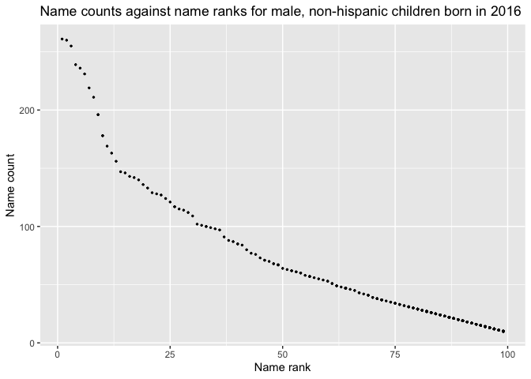

p8105\_hw2\_smm2350
================
Shaina Mackin
2021-10-09

# Homework 2

## Problem 1

### First, I will read and clean the Mr. Trash Wheel sheet.

This includes specifying the sheet and omitting non-data entries using
`read_excel`, using reasonable variable names, omitting rows without
dumpster-specific data, and rounding the number of sports balls to the
nearest integer:

``` r
trash_df = 
  read_excel("data files/Trash-Wheel-Collection-Totals-7-2021-sept.xlsx", 
  sheet = "Mr. Trash Wheel", 
  range = "A2:N575",
  col_names = TRUE) %>%
janitor::clean_names() %>%
drop_na() %>%
mutate(sports_balls = round(sports_balls), digits = 0)
```

### Second, I will read and clean the precipitation data for 2018 and 2019.

This includes omitting rows without precipitation data and adding a
variable for year:

``` r
precip2018_df = 
  read_excel("data files/Trash-Wheel-Collection-Totals-7-2021-sept.xlsx",
  sheet = "2018 Precipitation",
  skip = 1,
  col_names = TRUE) %>%
janitor::clean_names() %>%
drop_na() %>%
mutate(year = 2018)
  
precip2019_df = 
  read_excel("data files/Trash-Wheel-Collection-Totals-7-2021-sept.xlsx",
  sheet = "2019 Precipitation",
  skip = 1,
  col_names = TRUE) %>%
janitor::clean_names() %>%
drop_na() %>%
mutate(year = 2019)
```

### Next, I will combine the two precipitation datasets.

I will also convert month to a character variable:

``` r
precip_df = 
  bind_rows(precip2018_df, precip2019_df) %>%
  janitor::clean_names() %>%
  mutate(month = month.name[as.numeric(month)])
```

### Data description:

The Mr. Trash Wheel dataset has 486 observations. The median number of
sports balls in a dumpster in 2019 was 9 balls. In addition to sports
balls, the dataset records number of `cigarette butts`, `glass bottles`,
`plastic bottles`, `polystyrene`, `grocery bags`, and `chip bags` every
`month` for 2014 to 2021. The precipitation dataset has 24 observations,
or months. The total precipitation in 2018 was 70.33 inches. The
precipitation dataset includes the following variables: month, total,
year.

## Problem 2

### I will clean the `pols` and `snp` datasets.

``` r
pols_df = 
  read_csv("data files/fivethirtyeight_datasets/pols-month.csv") %>%
  janitor::clean_names() %>%
  separate(mon, c("year", "month", "day")) %>%
  mutate(month = month.name[as.numeric(month)]) %>%
  mutate(year = as.numeric(year)) %>%
  mutate(president = factor(prez_dem, labels = c("gop", "dem"))) %>%
  select(-prez_dem, -prez_gop, -day)
```

    ## Rows: 822 Columns: 9

    ## ── Column specification ────────────────────────────────────────────────────────
    ## Delimiter: ","
    ## dbl  (8): prez_gop, gov_gop, sen_gop, rep_gop, prez_dem, gov_dem, sen_dem, r...
    ## date (1): mon

    ## 
    ## ℹ Use `spec()` to retrieve the full column specification for this data.
    ## ℹ Specify the column types or set `show_col_types = FALSE` to quiet this message.

``` r
snp_df = 
  read_csv("data files/fivethirtyeight_datasets/snp.csv") %>%
  janitor::clean_names() %>%
  mutate(date = lubridate::mdy(date)) %>%
  separate(date, c("year", "month", "date")) %>%
  mutate(month = month.name[as.numeric(month)]) %>%
  mutate(year = as.numeric(year)) %>%
  mutate(year = ifelse(year > 2021, year - 100, year)) %>%
  select(-date)
```

    ## Rows: 787 Columns: 2

    ## ── Column specification ────────────────────────────────────────────────────────
    ## Delimiter: ","
    ## chr (1): date
    ## dbl (1): close

    ## 
    ## ℹ Use `spec()` to retrieve the full column specification for this data.
    ## ℹ Specify the column types or set `show_col_types = FALSE` to quiet this message.

### Next, I will tidy the `unemployment` data.

This will let me merge it with the previous datasets later:

``` r
unemployment_df = read_csv("data files/fivethirtyeight_datasets/unemployment.csv")
```

    ## Rows: 68 Columns: 13

    ## ── Column specification ────────────────────────────────────────────────────────
    ## Delimiter: ","
    ## dbl (13): Year, Jan, Feb, Mar, Apr, May, Jun, Jul, Aug, Sep, Oct, Nov, Dec

    ## 
    ## ℹ Use `spec()` to retrieve the full column specification for this data.
    ## ℹ Specify the column types or set `show_col_types = FALSE` to quiet this message.

``` r
unemployment_tidy_df = 
  read_csv("data files/fivethirtyeight_datasets/unemployment.csv") %>%
  pivot_longer(
    Jan:Dec,
    names_to = "month",
    values_to = "unemployment") %>%
  mutate(month = match(month, month.abb)) %>%
  mutate(month = month.name[as.numeric(month)]) %>%
  janitor::clean_names() 
```

    ## Rows: 68 Columns: 13

    ## ── Column specification ────────────────────────────────────────────────────────
    ## Delimiter: ","
    ## dbl (13): Year, Jan, Feb, Mar, Apr, May, Jun, Jul, Aug, Sep, Oct, Nov, Dec

    ## 
    ## ℹ Use `spec()` to retrieve the full column specification for this data.
    ## ℹ Specify the column types or set `show_col_types = FALSE` to quiet this message.

### Lastly, I will join the datasets.

First, I will merge `snp` and `pols`; then I will merge `unemployment`
into the result:

``` r
snp_pols_df = 
  left_join(pols_df, snp_df, by = c("year", "month"))

snp_pols_unemploy_df = 
  left_join(snp_pols_df, unemployment_tidy_df, by = c("year", "month"))
```

### Data description:

The `pols` dataset contained 822 observations, or dates, ranging from
1947 to 2015, with 9 variables all related to the number of `gop` or
`dem` politicians in office at that time. The `snp` dataset contained
787 observations, or dates, ranging from 1950 to 2015, with the variable
`close` referring to the corresponding closing value of the S&P stock
index at that time. The `unemployment` dataset originally contained 68
observations, or years, with `month` variables and their corresponding
percentages of unemployment. The tidied `unemployment` dataset contains
816 observations, or dates, ranging from 1948 to 2015, with their
corresponding `unemployment` percentages. The joined `snp_pols_unemploy`
dataset now contains 822 observations, or dates, ranging from 1947 to
2015, with 11 variables including `close` value, `unemployment`
percentage, and political party (whether `dem` or `rep`) of politicians
accordingly.

## Problem 3

### First, I will load and tidy the baby names data.

``` r
babies_df = 
  read_csv("data files/Popular_Baby_Names.csv") %>%
  janitor::clean_names() %>%
  mutate(childs_first_name = str_to_lower(childs_first_name)) %>%
  mutate(gender = str_to_lower(gender)) %>%
  mutate(ethnicity = ifelse(grepl("ASIAN AND PACI", ethnicity), "ASIAN AND PACIFIC ISLANDER", 
                            ifelse(grepl("BLACK NON HISP", ethnicity), "BLACK NON HISPANIC",
                                   ifelse(grepl("WHITE NON HISP", ethnicity), "WHITE NON HISPANIC",
                                          "HISPANIC")))) %>%
  mutate(ethnicity = str_to_lower(ethnicity))  %>%
  distinct()
```

    ## Rows: 19418 Columns: 6

    ## ── Column specification ────────────────────────────────────────────────────────
    ## Delimiter: ","
    ## chr (3): Gender, Ethnicity, Child's First Name
    ## dbl (3): Year of Birth, Count, Rank

    ## 
    ## ℹ Use `spec()` to retrieve the full column specification for this data.
    ## ℹ Specify the column types or set `show_col_types = FALSE` to quiet this message.

### Now, I will make some tables.

``` r
olivia_df = 
  filter(babies_df, childs_first_name == "olivia", gender == "female")

olivia_df %>%
  select(-gender, -childs_first_name, -count) %>%
  pivot_wider(
    names_from = "year_of_birth",
    values_from = "rank"
  ) %>%
knitr::kable(caption = "Rank in popularity of Olivia as a female baby name over time, by ethnicity")
```

| ethnicity                  | 2016 | 2015 | 2014 | 2013 | 2012 | 2011 |
|:---------------------------|-----:|-----:|-----:|-----:|-----:|-----:|
| asian and pacific islander |    1 |    1 |    1 |    3 |    3 |    4 |
| black non hispanic         |    8 |    4 |    8 |    6 |    8 |   10 |
| hispanic                   |   13 |   16 |   16 |   22 |   22 |   18 |
| white non hispanic         |    1 |    1 |    1 |    1 |    4 |    2 |

Rank in popularity of Olivia as a female baby name over time, by
ethnicity

``` r
male_df = 
  filter(babies_df, gender == "male", rank == 1) 

male_df %>%
  select(-gender, -count, -rank) %>%
  pivot_wider(
    names_from = "year_of_birth",
    values_from = "childs_first_name"
  ) %>%
knitr::kable(caption = "Most popular male baby name over time, by ethnicity")
```

| ethnicity                  | 2016   | 2015   | 2014   | 2013   | 2012   | 2011    |
|:---------------------------|:-------|:-------|:-------|:-------|:-------|:--------|
| asian and pacific islander | ethan  | jayden | jayden | jayden | ryan   | ethan   |
| black non hispanic         | noah   | noah   | ethan  | ethan  | jayden | jayden  |
| hispanic                   | liam   | liam   | liam   | jayden | jayden | jayden  |
| white non hispanic         | joseph | david  | joseph | david  | joseph | michael |

Most popular male baby name over time, by ethnicity

### Lastly, I will make a scatter plot.

``` r
male2016_df = 
  filter(babies_df, year_of_birth == 2016, gender == "male", ethnicity == "white non hispanic") %>%
  select(-year_of_birth, -gender, -ethnicity)

male2016_df %>%
  ggplot(aes(x = rank, y = count)) +
  geom_point(size = .5) +
  labs(
    title = "Name counts against name ranks for male, non-hispanic children born in 2016",
    x = "Name rank",
    y = "Name count")
```

<!-- -->
